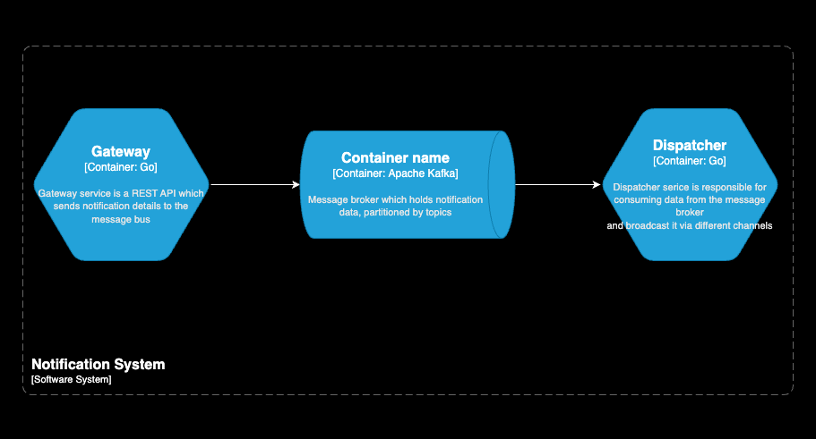
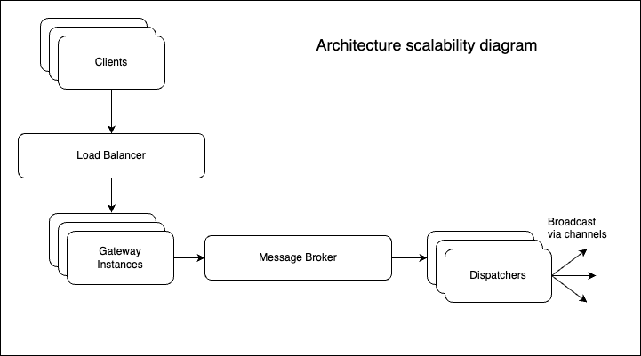

# Notification System Assignment

## Requirements
Notification-sending system requirements:

- The system needs to be able to send notifications via several different channels (email, sms, slack) and be easily extensible to support more channels in the future.

- The system needs to be horizontally scalable.

- The system must guarantee an "at least once" SLA for sending the message.

- The interface for accepting notifications to be sent is an HTTP API, however, that doesn’t mean message queues (e.g Kafka) can’t be used.

## Overview
This project is a notification-sending system designed to dispatch notifications through various channels such as Email, SMS, and Slack. It uses Apache Kafka as a message broker to decouple the sending logic from the HTTP gateway, ensuring scalability and resilience. Feature set includes the following list:

- Supports sending notifications via Email, SMS, and Slack (mock implementations).
- Horizontally scalable with Kafka message broker.
- Follows an "at least once" delivery guarantee using Kafka's manual offset management.
- Asynchronous communication between services via Kafka topics.
- Easily extensible to support new notification channels in the future (Dispatcher interface).

## Architecture
The system is built using two core services:

1. **Gateway Service**: Accepts incoming HTTP POST requests containing the notification details.The Gateway Service receives notification requests and publishes them to the relevant Kafka topics. The Dispatcher Service consumes these topics and sends the notifications to their recipients.

2. **Dispatcher Service**: Listens to Kafka topics (email, sms, and slack), processes messages, and dispatches notifications via the appropriate channel.

#### Architecture diagram


### Scalability
This software system can be easily scalled horizontally by adding more distances of both services. Additional software components should be introduced, e.g. load balancer to distribute the traffic among the working Gateway services. The Kafka component may be used in a cluster to ensure higher availability and it can also act as a topic-based load balancer among the Dispatcher services.




### Software components
#### Dispatcher Service

The Dispatcher Service processes messages from Kafka topics and sends notifications. It contains:
- **MessageBusConsumer**: Responsible for consuming messages from Kafka and acknowledging them to ensure that all notifications are broadcasted successfully.
- **NotificationDispatcher**: Interface for dispatching notifications through different channels (Email, SMS, Slack).

#### Notification Dispatchers
Each Dispatcher services utilized 3 separate go routines to process different types of notifications independantly. There are three mock dispatchers for different channels:
- EmailDispatcher
- SmsDispatcher
- SlackDispatcher

#### Kafka Integration
Kafka is used for decoupling the services and ensuring asynchronous message processing.
The Dispatcher Service listens to Kafka topics and processes the messages.
- **Kafka Topics**: email, sms, and slack topics for each notification type. They can be further extended with more channels.
- **Manual Offset Management**:
Kafka messages are consumed with manual offset acknowledgment to guarantee at least once delivery.
After processing and dispatching a notification, the system acknowledges the Kafka message, committing the offset.

## How to use?
Both services need to be build with the ```go build``` command in the respective directory within the ```cmd``` directory. Please, check the ```config.go``` files if you want to modify the env variables, required by the services.

### Docker setup
In the ```docker-compose.yml``` you can find the Docker configuration for the Kafka and Zookeeper. You can start the services by running: 

```docker-compose up -d```

Also, in order to create the topics, you have to run 

```docker exec -it kafka /bin/bash /usr/bin/create_kafka_topics.sh```
